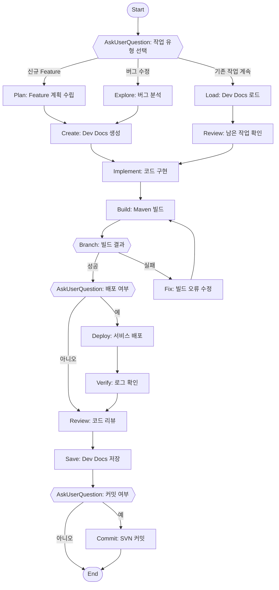

## Workflow Execution Guide

Follow the Mermaid flowchart above to execute the workflow. Each node type has specific execution methods as described below.

### Execution Methods by Node Type

- **Rectangle nodes**: Execute Sub-Agents using the Task tool
- **Diamond nodes (AskUserQuestion:...)**: Use the AskUserQuestion tool to prompt the user and branch based on their response
- **Diamond nodes (Branch/Switch:...)**: Automatically branch based on the results of previous processing (see details section)
- **Rectangle nodes (Prompt nodes)**: Execute the prompts described in the details section below

---

## Node Details

### ask_task_type
**Type**: AskUserQuestion
**Question**: 어떤 작업을 진행하시겠습니까?
**Options**:
- 신규 Feature: 새로운 기능 개발
- 버그 수정: 기존 버그 수정
- 기존 작업 계속: 이전 Dev Docs 기반으로 계속

### plan_feature
**Type**: Task (subagent: Plan)
**Prompt**:
사용자가 요청한 Feature에 대해 KiiPS 프로젝트 컨텍스트를 분석하고 구현 계획을 수립하세요.
- 관련 모듈 식별 (KiiPS-FD, KiiPS-IL, KiiPS-UI 등)
- 필요한 파일 목록
- 구현 단계 정의

### analyze_bug
**Type**: Task (subagent: Explore)
**Prompt**:
버그의 근본 원인을 분석하세요.
- 관련 로그 확인
- 코드 흐름 추적
- 재현 조건 파악

### load_context
**Type**: Prompt
**Action**: dev/active/ 폴더의 기존 Dev Docs 파일들을 읽어 컨텍스트를 복원합니다.
```
dev/active/{project-name}/{project-name}-plan.md - 계획 문서
dev/active/{project-name}/{project-name}-context.md - 컨텍스트 정보
dev/active/{project-name}/{project-name}-tasks.md - 작업 목록
```

### create_dev_docs
**Type**: Skill
**Skill**: /dev-docs
**Action**: Feature/버그 수정에 대한 Dev Docs 3-파일 시스템 생성

### review_tasks
**Type**: Prompt
**Action**: dev/tasks.md에서 남은 작업 목록을 확인하고 TodoWrite로 진행 상황 추적

### implement
**Type**: Prompt
**Action**:
1. TodoWrite로 작업 목록 생성
2. 각 작업 순차적 구현
3. 진행 상황 업데이트

### build
**Type**: Skill
**Skill**: /build-service
**Action**: KiiPS-HUB에서 관련 모듈 Maven 빌드 실행

### build_result
**Type**: Branch
**Condition**: 빌드 결과 확인
- 성공: BUILD SUCCESS 메시지 확인
- 실패: BUILD FAILURE 또는 에러 발생

### fix_build
**Type**: Prompt
**Action**: 빌드 오류 분석 및 수정
- 컴파일 에러 수정
- 의존성 문제 해결
- 테스트 실패 수정

### ask_deploy
**Type**: AskUserQuestion
**Question**: 서비스를 배포하시겠습니까?
**Options**:
- 예: 서비스 배포 진행
- 아니오: 코드 리뷰만 진행

### deploy
**Type**: Skill
**Skill**: /deploy-service
**Action**: 빌드된 서비스를 배포하고 시작

### verify_logs
**Type**: Skill
**Skill**: /view-logs
**Action**: 배포된 서비스의 로그를 확인하여 정상 동작 검증

### code_review
**Type**: Skill
**Skill**: /review
**Action**: 변경된 코드에 대한 종합 리뷰 수행
- 코드 품질 검사
- 보안 검사
- 성능 검토

### save_context
**Type**: Skill
**Skill**: /save-and-compact
**Action**: 현재 작업 상태를 Dev Docs에 저장하고 컨텍스트 정리

### ask_commit
**Type**: AskUserQuestion
**Question**: SVN에 커밋하시겠습니까?
**Options**:
- 예: 커밋 진행
- 아니오: 나중에 커밋

### commit
**Type**: Prompt
**Action**: SVN 커밋 실행
```bash
cd KiiPS-{service}/
svn add --force .
svn commit -m "커밋 메시지"
```

---

## Quick Reference

| 단계 | Skill/Command | 설명 |
|------|---------------|------|
| 계획 | /dev-docs | Dev Docs 생성 |
| 빌드 | /build-service | Maven 빌드 |
| 배포 | /deploy-service | 서비스 배포 |
| 로그 | /view-logs | 로그 확인 |
| 리뷰 | /review | 코드 리뷰 |
| 저장 | /save-and-compact | 컨텍스트 저장 |
