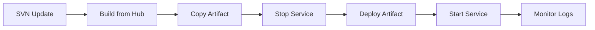

# KiiPS Deployment Guide

> 이 문서는 KiiPS 시스템의 빌드, 배포, 환경 관리 가이드를 포함합니다.
> 메인 컨텍스트: [CLAUDE.md](./CLAUDE.md) | 아키텍처: [architecture.md](./architecture.md)

---

## 🚀 Quick Deployment

### 프로덕션 배포 (빠른 참조)

```bash
# 1. 서비스 디렉토리로 이동
cd KiiPS-ServiceName/

# 2. 빌드 스크립트 실행 (SVN 업데이트 + 빌드 + 배포 + 재시작)
./build_ServiceName.sh

# 3. 로그 확인
tail -f logs/log.$(date "+%Y-%m-%d")-0.log
```

---

## 📋 Build Process

### 빌드 원칙 (CRITICAL)

**⚠️ 핵심 규칙:**
1. **항상 KiiPS-HUB에서 빌드** - 의존성 해결 보장
2. **빌드 순서 준수** - COMMON → UTILS → 서비스
3. **`-am` 플래그 사용** - Maven의 "also make"로 의존성 자동 빌드

### 전체 프로젝트 빌드

```bash
# KiiPS-HUB로 이동
cd /path/to/KiiPS-HUB/

# 전체 빌드
mvn clean package

# 테스트 스킵 (기본값)
mvn clean package -DskipTests=true

# 특정 프로파일로 빌드
mvn clean package -P production
```

### 특정 모듈 빌드

```bash
# KiiPS-HUB에서 특정 모듈 빌드 (의존성 포함)
cd KiiPS-HUB/
mvn clean package -pl :KiiPS-UI -am
mvn clean package -pl :KiiPS-FD -am
mvn clean package -pl :KiiPS-IL -am

# 여러 모듈 동시 빌드
mvn clean package -pl :KiiPS-FD,:KiiPS-IL,:KiiPS-PG -am
```

### 의존성 빌드

```bash
# 공통 모듈 먼저 빌드
cd KiiPS-HUB/
mvn clean package -pl :KiiPS-COMMON -am
mvn clean package -pl :KiiPS-UTILS -am

# 그 후 비즈니스 모듈 빌드
mvn clean package -pl :KiiPS-FD -am
```

### 빌드 결과물 확인

```bash
# JAR 파일 확인
ls -lh KiiPS-FD/target/*.jar

# WAR 파일 확인 (UI 모듈)
ls -lh KiiPS-UI/target/*.war

# 의존성 트리 확인
mvn dependency:tree -pl :KiiPS-FD
```

---

## 🏗️ Deployment Workflow

### 표준 배포 프로세스



### 1단계: SVN 업데이트

```bash
# 서비스 소스 업데이트
cd /path/to/source/KiiPS-ServiceName/
svn up

# 공통 모듈도 업데이트
cd /path/to/source/KiiPS-COMMON/
svn up

cd /path/to/source/KiiPS-UTILS/
svn up
```

### 2단계: 빌드

```bash
# KiiPS-HUB에서 빌드
cd /path/to/source/KiiPS-HUB/
mvn clean package -pl :KiiPS-ServiceName -am
```

### 3단계: 아티팩트 복사

```bash
# JAR 파일 복사 (대부분 서비스)
cp KiiPS-ServiceName/target/KiiPS-ServiceName-*.jar /deployment/path/

# WAR 파일 복사 (UI 모듈)
cp KiiPS-UI/target/KiiPS-UI-*.war /deployment/ui/
```

### 4단계: 서비스 재시작

```bash
# 배포 디렉토리로 이동
cd /deployment/path/

# 서비스 중지
./stop.sh

# 서비스 시작
./start.sh
```

### 5단계: 로그 모니터링

```bash
# 실시간 로그 확인
tail -f logs/log.$(date "+%Y-%m-%d")-0.log

# 에러 로그만 확인
tail -f logs/log.$(date "+%Y-%m-%d")-0.log | grep -i error

# 최근 100줄 확인
tail -100 logs/log.$(date "+%Y-%m-%d")-0.log
```

---

## 📜 Build Scripts

### 표준 빌드 스크립트 패턴

각 서비스는 `build_ServiceName.sh` 스크립트를 포함합니다:

```bash
#!/bin/bash

# 소스 디렉토리
SOURCE_DIR="/path/to/source"
DEPLOY_DIR="/path/to/deployment"

# 1. SVN 업데이트
cd ${SOURCE_DIR}/KiiPS-ServiceName/
svn up

cd ${SOURCE_DIR}/KiiPS-COMMON/
svn up

cd ${SOURCE_DIR}/KiiPS-UTILS/
svn up

# 2. 빌드
cd ${SOURCE_DIR}/KiiPS-HUB/
mvn clean package -pl :KiiPS-ServiceName -am

# 3. 아티팩트 복사
cp ${SOURCE_DIR}/KiiPS-ServiceName/target/KiiPS-ServiceName-*.jar ${DEPLOY_DIR}/

# 4. 배포 디렉토리로 이동
cd ${DEPLOY_DIR}

# 5. 서비스 재시작
./stop.sh
./start.sh

# 6. 로그 확인
tail -f logs/log.$(date "+%Y-%m-%d")-0.log
```

### UI 모듈 빌드 스크립트 예제

```bash
#!/bin/bash
# build_UI.sh

cd /path/to/source/KiiPS-UI/
svn up

cd /path/to/source/KiiPS-UTILS/
svn up

cd /path/to/source/KiiPS-COMMON/
svn up

cd /path/to/source/KiiPS-HUB/
mvn clean package -pl :KiiPS-UI -am

cp target/KiiPS-UI-0.0.1-SNAPSHOT.war /deployment/ui/

cd /deployment/ui/
./stop.sh
./start.sh

tail -f logs/log.$(date "+%Y-%m-%d")-0.log
```

---

## 🌍 Environment Configuration

### 환경별 프로퍼티 파일

각 서비스는 환경별로 독립된 설정 파일을 사용합니다:

| 파일 | 환경 | 용도 |
|------|------|------|
| `app-local.properties` | Local | 로컬 개발 (localhost, 개발 DB) |
| `app-stg.properties` | Staging | 스테이징 환경 (테스트 서버) |
| `app-kiips.properties` | Production | 프로덕션 환경 (운영 서버) |
| `app-shinhanvc.properties` | Shinhan VC | 신한VC 전용 설정 (일부 서비스) |

### Local 환경 설정 예제

```properties
# app-local.properties

# Server Configuration
server.port=8601
server.servlet.context-path=/fd

# Database Configuration
spring.datasource.url=jdbc:oracle:thin:@localhost:1521:KIIPSDEV
spring.datasource.username=kiips_dev
spring.datasource.password=dev_password

# API Gateway
api.gateway.url=http://localhost:8000

# Other Services
login.service.url=http://localhost:8801
common.service.url=http://localhost:8701

# Logging
logging.level.com.kiips=DEBUG
logging.file.path=./logs
```

### Staging 환경 설정 예제

```properties
# app-stg.properties

# Server Configuration
server.port=8601
server.servlet.context-path=/fd

# Database Configuration
spring.datasource.url=jdbc:oracle:thin:@stg-db.kiips.co.kr:1521:KIIPSSTG
spring.datasource.username=kiips_stg
spring.datasource.password=${DB_PASSWORD}

# API Gateway
api.gateway.url=http://stg-api.kiips.co.kr:8000

# Other Services
login.service.url=http://stg-login.kiips.co.kr:8801
common.service.url=http://stg-common.kiips.co.kr:8701

# Logging
logging.level.com.kiips=INFO
logging.file.path=/var/log/kiips/fd
```

### Production 환경 설정 예제

```properties
# app-kiips.properties

# Server Configuration
server.port=8601
server.servlet.context-path=/fd

# Database Configuration
spring.datasource.url=jdbc:oracle:thin:@prod-db.kiips.co.kr:1521:KIIPSPROD
spring.datasource.username=kiips_prod
spring.datasource.password=${DB_PASSWORD}

# API Gateway
api.gateway.url=https://api.kiips.co.kr

# Other Services
login.service.url=https://login.kiips.co.kr
common.service.url=https://common.kiips.co.kr

# Slack Notifications
slack.webhook.url=${SLACK_WEBHOOK_URL}
slack.error.channel=#kiips-errors-prod

# Logging
logging.level.com.kiips=WARN
logging.file.path=/var/log/kiips/fd
logging.file.max-size=100MB
logging.file.max-history=30
```

---

## 🔄 Service Management

### 서비스 시작/중지 스크립트

#### start.sh

```bash
#!/bin/bash
# start.sh

# 환경별 프로파일 선택
PROFILE="kiips"  # local, stg, kiips, shinhanvc

# JAR 파일명
JAR_NAME="KiiPS-ServiceName-0.0.1-SNAPSHOT.jar"

# JVM 옵션
JVM_OPTS="-Xms512m -Xmx2048m -XX:+UseG1GC"

# 서비스 시작
nohup java ${JVM_OPTS} \
  -jar ${JAR_NAME} \
  --spring.config.location=./app-${PROFILE}.properties \
  > /dev/null 2>&1 &

# PID 저장
echo $! > service.pid

echo "Service started with PID: $(cat service.pid)"
```

#### stop.sh

```bash
#!/bin/bash
# stop.sh

# PID 파일에서 프로세스 ID 읽기
if [ -f service.pid ]; then
  PID=$(cat service.pid)

  # 프로세스 존재 확인
  if ps -p ${PID} > /dev/null; then
    echo "Stopping service (PID: ${PID})..."
    kill ${PID}

    # Graceful shutdown 대기
    sleep 5

    # 강제 종료 확인
    if ps -p ${PID} > /dev/null; then
      echo "Force killing service..."
      kill -9 ${PID}
    fi

    rm service.pid
    echo "Service stopped."
  else
    echo "Service is not running."
    rm service.pid
  fi
else
  echo "PID file not found."
fi
```

### 서비스 상태 확인

```bash
# PID로 프로세스 확인
if [ -f service.pid ]; then
  PID=$(cat service.pid)
  ps -p ${PID} -o pid,ppid,cmd,%mem,%cpu
fi

# 포트로 프로세스 확인
lsof -i :8601

# Java 프로세스 전체 확인
ps aux | grep java | grep KiiPS
```

---

## 🐳 Docker Deployment (미래 계획)

### Dockerfile 예제

```dockerfile
# Dockerfile (예시 - 현재 미사용)
FROM openjdk:8-jdk-alpine

# 작업 디렉토리
WORKDIR /app

# JAR 파일 복사
COPY target/KiiPS-ServiceName-*.jar app.jar

# 환경 설정 파일 복사
COPY app-*.properties /app/

# 포트 노출
EXPOSE 8601

# 실행
ENTRYPOINT ["java", "-jar", "app.jar", "--spring.config.location=./app-kiips.properties"]
```

### Docker Compose 예제

```yaml
# docker-compose.yml (예시 - 현재 미사용)
version: '3.8'

services:
  kiips-fd:
    build: ./KiiPS-FD
    ports:
      - "8601:8601"
    environment:
      - SPRING_PROFILES_ACTIVE=kiips
    volumes:
      - ./logs:/app/logs
    restart: unless-stopped

  kiips-il:
    build: ./KiiPS-IL
    ports:
      - "8401:8401"
    environment:
      - SPRING_PROFILES_ACTIVE=kiips
    volumes:
      - ./logs:/app/logs
    restart: unless-stopped
```

---

## 📊 Health Checks

### 서비스 헬스 체크 엔드포인트

```bash
# Spring Boot Actuator 엔드포인트
curl http://localhost:8601/actuator/health

# 응답 예시
{
  "status": "UP",
  "components": {
    "db": {
      "status": "UP",
      "details": {
        "database": "Oracle",
        "validationQuery": "SELECT 1 FROM DUAL"
      }
    },
    "diskSpace": {
      "status": "UP",
      "details": {
        "total": 107374182400,
        "free": 53687091200,
        "threshold": 10485760
      }
    }
  }
}
```

### 헬스 체크 스크립트

```bash
#!/bin/bash
# health_check.sh

SERVICE_URL="http://localhost:8601"
HEALTH_ENDPOINT="${SERVICE_URL}/actuator/health"

# HTTP 상태 코드 확인
HTTP_CODE=$(curl -s -o /dev/null -w "%{http_code}" ${HEALTH_ENDPOINT})

if [ ${HTTP_CODE} -eq 200 ]; then
  echo "✅ Service is healthy (HTTP ${HTTP_CODE})"
  exit 0
else
  echo "❌ Service is unhealthy (HTTP ${HTTP_CODE})"
  exit 1
fi
```

---

## 🔐 Security Considerations

### 환경 변수 사용

민감한 정보는 환경 변수로 관리:

```bash
# .env 파일 (버전 관리 제외)
DB_PASSWORD=secure_password
SLACK_WEBHOOK_URL=https://hooks.slack.com/services/xxx
API_KEY=your-api-key-here
```

```properties
# app-kiips.properties
spring.datasource.password=${DB_PASSWORD}
slack.webhook.url=${SLACK_WEBHOOK_URL}
```

### 시작 스크립트에서 환경 변수 로드

```bash
#!/bin/bash
# start.sh (보안 강화 버전)

# 환경 변수 로드
if [ -f .env ]; then
  export $(cat .env | xargs)
fi

# 서비스 시작
nohup java ${JVM_OPTS} \
  -jar ${JAR_NAME} \
  --spring.config.location=./app-kiips.properties \
  > /dev/null 2>&1 &
```

---

## 📝 Deployment Checklist

### 배포 전 체크리스트

- [ ] SVN 최신 버전으로 업데이트
- [ ] 의존성 모듈(COMMON, UTILS) 최신 버전 확인
- [ ] 빌드 성공 확인 (`mvn clean package`)
- [ ] 환경별 설정 파일 검증
- [ ] 데이터베이스 마이그레이션 스크립트 확인 (필요시)
- [ ] 백업 생성 (기존 JAR/WAR 파일)

### 배포 중 체크리스트

- [ ] 서비스 정상 종료 확인 (`ps` 명령으로 프로세스 확인)
- [ ] 새 아티팩트 복사 완료
- [ ] 서비스 시작 성공
- [ ] PID 파일 생성 확인
- [ ] 초기 로그 에러 없음 확인

### 배포 후 체크리스트

- [ ] 헬스 체크 엔드포인트 응답 확인
- [ ] 주요 API 엔드포인트 기능 테스트
- [ ] 로그 모니터링 (최소 5분)
- [ ] Slack 알림 정상 작동 확인
- [ ] 데이터베이스 연결 정상 확인
- [ ] 다른 서비스와의 통신 확인

---

## 🚨 Rollback Procedure

### 롤백 프로세스

```bash
# 1. 현재 서비스 중지
./stop.sh

# 2. 백업 파일로 복원
cp backup/KiiPS-ServiceName-previous.jar KiiPS-ServiceName-0.0.1-SNAPSHOT.jar

# 3. 서비스 재시작
./start.sh

# 4. 로그 확인
tail -f logs/log.$(date "+%Y-%m-%d")-0.log
```

### 백업 전략

```bash
# 배포 전 자동 백업 스크립트
#!/bin/bash
# backup_before_deploy.sh

BACKUP_DIR="./backup"
DATE=$(date +%Y%m%d_%H%M%S)

# 백업 디렉토리 생성
mkdir -p ${BACKUP_DIR}

# 현재 JAR 파일 백업
if [ -f KiiPS-ServiceName-*.jar ]; then
  cp KiiPS-ServiceName-*.jar ${BACKUP_DIR}/KiiPS-ServiceName-${DATE}.jar
  echo "Backup created: ${BACKUP_DIR}/KiiPS-ServiceName-${DATE}.jar"
fi

# 오래된 백업 삭제 (7일 이상)
find ${BACKUP_DIR} -name "*.jar" -mtime +7 -delete
```

---

## 📈 Monitoring

### 로그 파일 구조

```
logs/
├── log.2025-12-26-0.log     # 오늘 로그
├── log.2025-12-25-0.log     # 어제 로그
└── archived/
    ├── log.2025-12-24.gz    # 압축된 과거 로그
    └── log.2025-12-23.gz
```

### 로그 레벨 설정

```properties
# 개발 환경
logging.level.root=INFO
logging.level.com.kiips=DEBUG

# 스테이징 환경
logging.level.root=INFO
logging.level.com.kiips=INFO

# 프로덕션 환경
logging.level.root=WARN
logging.level.com.kiips=WARN
logging.level.com.kiips.exception=ERROR
```

### 로그 모니터링 명령어

```bash
# 실시간 로그 (에러만)
tail -f logs/log.$(date "+%Y-%m-%d")-0.log | grep -i error

# 특정 키워드 검색
grep -i "NullPointerException" logs/log.$(date "+%Y-%m-%d")-0.log

# 최근 에러 100개
tail -10000 logs/log.$(date "+%Y-%m-%d")-0.log | grep -i error | tail -100

# 에러 발생 빈도 집계
grep -i error logs/log.$(date "+%Y-%m-%d")-0.log | wc -l
```

---

## 🔧 Performance Tuning

### JVM 옵션 최적화

```bash
# 프로덕션 추천 JVM 옵션
JVM_OPTS="
  -Xms2g
  -Xmx4g
  -XX:+UseG1GC
  -XX:MaxGCPauseMillis=200
  -XX:+HeapDumpOnOutOfMemoryError
  -XX:HeapDumpPath=./heapdump
  -XX:+PrintGCDetails
  -XX:+PrintGCDateStamps
  -Xloggc:./gc.log
"
```

### 데이터베이스 커넥션 풀 설정

```properties
# HikariCP 설정 (Spring Boot 기본)
spring.datasource.hikari.maximum-pool-size=20
spring.datasource.hikari.minimum-idle=5
spring.datasource.hikari.connection-timeout=30000
spring.datasource.hikari.idle-timeout=600000
spring.datasource.hikari.max-lifetime=1800000
```

---

이 가이드를 통해 KiiPS 서비스를 안전하고 효율적으로 배포할 수 있습니다.
