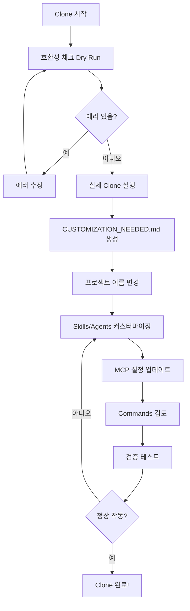

# Claude Code Configuration Clone Guide

다른 프로젝트에 LiveMetro의 Claude Code 설정을 복제하는 완벽 가이드입니다.

## 📋 목차

- [언제 Clone을 사용하나요?](#언제-clone을-사용하나요)
- [호환성 체크리스트](#호환성-체크리스트)
- [Clone 방법](#clone-방법)
- [커스터마이징 가이드](#커스터마이징-가이드)
- [문제 해결](#문제-해결)

---

## 언제 Clone을 사용하나요?

### ✅ Clone이 적합한 경우

1. **유사한 기술 스택**
   - React Native/Expo 프로젝트
   - Firebase 사용 프로젝트
   - TypeScript 기반 프로젝트

2. **유사한 도메인**
   - 실시간 데이터 처리
   - 모바일 앱 개발
   - API 통합이 많은 프로젝트

3. **팀 표준화**
   - 동일한 개발 워크플로우 적용
   - 일관된 코드 품질 기준
   - 공통 개발 도구 사용

### ⚠️ Clone이 적합하지 않은 경우

1. **완전히 다른 기술 스택**
   - Vue.js, Angular 등 다른 프레임워크
   - Python, Java 등 다른 언어
   - 웹 전용 프로젝트

2. **완전히 다른 도메인**
   - 전혀 다른 비즈니스 로직
   - 특수한 산업/분야 전문 지식 필요

이런 경우에는 처음부터 새로운 설정을 만드는 것이 좋습니다.

---

## 호환성 체크리스트

Clone 스크립트가 자동으로 체크하는 항목들:

### 🔴 Critical (반드시 확인)

- [ ] **대상 프로젝트 존재 여부**
  - 프로젝트 디렉토리가 실제로 존재하는가?
  - 읽기/쓰기 권한이 있는가?

### 🟡 Warning (권장 확인)

- [ ] **프로젝트 타입**
  - `package.json`이 있는가? (Node.js 프로젝트)
  - React Native/Expo 의존성이 있는가?

- [ ] **기술 스택 의존성**
  - Firebase 사용 여부
  - TypeScript 사용 여부
  - 테스트 프레임워크 (Jest) 사용 여부

- [ ] **기존 설정 존재**
  - 이미 `.claude/` 디렉토리가 있는가?
  - 기존 설정을 보존해야 하는가?

- [ ] **하드코딩된 경로**
  - `mcp.json`에 절대 경로가 있는가?
  - `settings.local.json`에 사용자별 경로가 있는가?

### 🔵 Info (참고사항)

- [ ] **프로젝트별 Skill**
  - LiveMetro 전용 skill이 포함되어 있는가?
  - 대상 프로젝트에서 제거/수정이 필요한가?

- [ ] **환경 변수**
  - MCP API 키가 `.env`에 설정되어 있는가?
  - 대상 프로젝트에 동일한 키가 필요한가?

---

## Clone 방법

### 1. 호환성 사전 체크 (Dry Run)

실제로 복사하지 않고 호환성만 체크:

```bash
npm run clone:claude:check -- --target=/path/to/other/project
```

**출력 예시:**
```
🔍 Compatibility Analysis:

────────────────────────────────────────────────────────────────────────────────

⚠️  WARNINGS (review recommended):
   • Target project is not a React Native/Expo project
     → LiveMetro skills are optimized for React Native. You may need to customize skills for your stack.
   • mcp.json may contain hardcoded absolute paths
     → Review and update paths after cloning

💡 INFO (good to know):
   • Target project does not use Firebase
     → firebase-integration skill may not be relevant
   • Skill 'subway-data-processor' is LiveMetro-specific
     → Review and adapt skill content for target project

────────────────────────────────────────────────────────────────────────────────
Total: 0 errors, 2 warnings, 2 info

🏃 Dry run mode - no files will be copied.

✅ Compatibility check complete. Run without --dry-run to proceed.
```

### 2. 현재 설정 복제

현재 LiveMetro의 `.claude/` 디렉토리를 복제:

```bash
npm run clone:claude -- --target=/path/to/other/project
```

### 3. 특정 백업에서 복제

특정 백업 버전에서 복제:

```bash
# 먼저 백업 목록 확인
npm run restore:claude:list

# 특정 백업 선택해서 복제
npm run clone:claude -- --target=/path/to/other/project --backup=backup-2025-12-29_14-30-00
```

### 4. 확인 없이 자동 실행

CI/CD나 자동화 스크립트용:

```bash
npm run clone:claude -- --target=/path/to/other/project --yes
```

### 5. 로컬 설정 포함

`settings.local.json`도 함께 복제 (기본적으로 제외됨):

```bash
npm run clone:claude -- --target=/path/to/other/project --include-local-settings
```

---

## Clone 후 자동 생성되는 파일

### CUSTOMIZATION_NEEDED.md

Clone이 완료되면 대상 프로젝트의 `.claude/` 디렉토리에 자동으로 생성됩니다:

```
/path/to/other/project/.claude/CUSTOMIZATION_NEEDED.md
```

이 파일에는:
- 발견된 호환성 문제들
- 수정해야 할 항목 목록
- 단계별 커스터마이징 가이드

**반드시 이 파일을 읽고 지침을 따르세요!**

---

## 커스터마이징 가이드

Clone 후 반드시 수행해야 할 작업들:

### 1. 프로젝트 이름 변경

**문제**: "LiveMetro"라는 이름이 여러 파일에 하드코딩되어 있음

**해결**:
```bash
cd /path/to/other/project/.claude

# LiveMetro 참조 찾기
grep -r "LiveMetro" . --exclude-dir=node_modules

# 수동으로 각 파일을 열어서 프로젝트 이름으로 변경
```

**변경 대상 파일**:
- `.claude/README.md`
- `.claude/agents/*.md` (각 agent의 설명)
- `.claude/skills/*/SKILL.md` (skill 설명)

### 2. Skills 검토 및 수정

#### 제거해야 할 Skills (프로젝트와 무관한 경우)

```bash
# LiveMetro 전용 skill 제거 예시
rm -rf .claude/skills/subway-data-processor
```

**검토 대상**:
- `subway-data-processor`: 서울 지하철 데이터 전용 → 제거 또는 범용화
- `notification-system`: Expo Notifications 기반 → 다른 푸시 서비스 사용 시 수정
- `location-services`: GPS 기능 없으면 제거

#### 수정해야 할 Skills

**react-native-development**:
```markdown
<!-- Before -->
LiveMetro의 React Native 컴포넌트 개발...

<!-- After -->
[Your Project]의 React Native 컴포넌트 개발...
```

**firebase-integration**:
- Firebase 사용 안 하면 제거
- 다른 DB(Supabase, AWS 등) 사용 시 이름 변경 및 내용 수정

### 3. Agents 커스터마이징

#### `.claude/agents/mobile-ui-specialist.md`

```markdown
---
name: mobile-ui-specialist
description: React Native UI/UX specialist for [Your Project Name]
model: sonnet
tools: [edit, create, read, grep]
---

# Mobile UI Specialist for [Your Project]

Expert in React Native UI/UX design and implementation for [Your Project].

## Expertise

- [Your App] specific design system
- [Your Target Platform] guidelines compliance
...
```

### 4. MCP 서버 설정

#### `.claude/mcp.json` 검토

**절대 경로 수정**:
```json
{
  "mcpServers": {
    "filesystem": {
      "command": "npx",
      "args": ["-y", "@modelcontextprotocol/server-filesystem", "/Users/younghwankang/Work"],
      "disabled": true
    }
  }
}
```

→ `/Users/younghwankang/Work`를 대상 프로젝트 경로로 변경

**API 키 설정**:
```bash
# 대상 프로젝트의 .env 파일에 추가
TWENTYFIRST_API_KEY=your_key_here
TAVILY_API_KEY=your_key_here
```

### 5. Commands 검토

#### `.claude/commands/check-health.md`

npm 스크립트 참조 확인:
- `npm run type-check` → 대상 프로젝트에 존재하는가?
- `npm run lint` → ESLint 설정이 있는가?
- `npm run test` → Jest가 설정되어 있는가?

없는 스크립트는 제거하거나 대상 프로젝트의 스크립트로 변경

### 6. skill-rules.json 업데이트

**주의**: 이 파일은 `.claude/` 밖에 있습니다!

```bash
# LiveMetro에서 복사
cp /path/to/livemetro/skill-rules.json /path/to/other/project/

# 내용 수정
vim /path/to/other/project/skill-rules.json
```

**수정 항목**:
- 파일 패턴: LiveMetro 구조와 다르면 수정
- Skill 이름: 제거한 skill은 삭제
- 우선순위: 프로젝트 특성에 맞게 조정

---

## 검증 체크리스트

Clone 및 커스터마이징 완료 후:

### 1. 파일 검증

```bash
cd /path/to/other/project

# 불필요한 LiveMetro 참조 남아있는지 확인
grep -r "LiveMetro" .claude/ --exclude-dir=node_modules

# 절대 경로 하드코딩 확인
grep -r "/Users/younghwankang" .claude/
```

### 2. Claude Code에서 테스트

```bash
# 대상 프로젝트에서 Claude Code 실행
cd /path/to/other/project
code .  # VS Code 열기

# Claude Code CLI로 테스트
claude-code
```

**테스트 항목**:
1. Skills 로드 확인: "list available skills"
2. Agents 작동 확인: "@mobile-ui-specialist hello"
3. Commands 작동 확인: "/check-health"
4. MCP 서버 연결: "list MCP servers"

### 3. 기능 테스트

간단한 작업으로 설정 검증:

```
# Skill 테스트
"Using react-native-development skill, create a simple Button component"

# Agent 테스트
"@mobile-ui-specialist Review the current screen layout"

# Command 테스트
"/check-health"
```

---

## 모범 사례

### 1. 단계적 적용

❌ **나쁜 예**: 모든 설정을 한 번에 복제
```bash
npm run clone:claude -- --target=/new/project --yes
# 바로 사용 시작
```

✅ **좋은 예**: 검증 후 단계적 적용
```bash
# 1. Dry run으로 호환성 체크
npm run clone:claude:check -- --target=/new/project

# 2. 복제 실행
npm run clone:claude -- --target=/new/project

# 3. CUSTOMIZATION_NEEDED.md 읽기
cat /new/project/.claude/CUSTOMIZATION_NEEDED.md

# 4. 하나씩 커스터마이징
# 5. 테스트
# 6. 프로덕션 적용
```

### 2. 선택적 복제

모든 것을 복제하지 말고, 필요한 것만:

```bash
# 복제 후 불필요한 skill 제거
cd /new/project/.claude/skills
rm -rf subway-data-processor  # 프로젝트와 무관
rm -rf location-services       # GPS 기능 없음
```

### 3. 템플릿화

자주 사용하는 설정은 템플릿으로 관리:

```bash
# 범용 템플릿 생성
mkdir ~/claude-config-templates
npm run clone:claude -- --target=~/claude-config-templates/react-native-base

# 프로젝트별 커스터마이징 후 저장
# 나중에 다른 프로젝트에 재사용
```

---

## 문제 해결

### Clone 실패 케이스

#### 1. "Target project directory does not exist"

**원인**: 경로가 잘못됨

**해결**:
```bash
# 경로 확인
ls -la /path/to/other/project

# 절대 경로 사용
npm run clone:claude -- --target=/absolute/path/to/project
```

#### 2. "Permission denied"

**원인**: 대상 디렉토리 쓰기 권한 없음

**해결**:
```bash
# 권한 확인
ls -la /path/to/other

# 필요시 권한 변경
chmod u+w /path/to/other/project
```

#### 3. Skills가 작동하지 않음

**원인**: 프로젝트 구조가 다름

**해결**:
- `skill-rules.json`의 파일 패턴 업데이트
- Skill 내용 수정
- 또는 명시적 호출: "Using skill-name, do X"

#### 4. MCP 서버 연결 실패

**원인**: API 키 미설정

**해결**:
```bash
# 대상 프로젝트에 .env 파일 생성
cd /path/to/other/project
cat >> .env << EOF
TWENTYFIRST_API_KEY=your_key
TAVILY_API_KEY=your_key
EOF

# Claude Code 재시작
```

---

## 고급 사용법

### 1. 여러 프로젝트에 일괄 Clone

```bash
#!/bin/bash
# clone-to-all.sh

PROJECTS=(
  "/path/to/project1"
  "/path/to/project2"
  "/path/to/project3"
)

for project in "${PROJECTS[@]}"; do
  echo "Cloning to $project..."
  npm run clone:claude -- --target="$project" --yes
done
```

### 2. CI/CD 통합

```yaml
# .github/workflows/clone-claude-config.yml
name: Clone Claude Config

on:
  workflow_dispatch:
    inputs:
      target_project:
        description: 'Target project path'
        required: true

jobs:
  clone:
    runs-on: ubuntu-latest
    steps:
      - uses: actions/checkout@v4
      - uses: actions/setup-node@v4
      - run: npm ci
      - run: npm run clone:claude -- --target=${{ github.event.inputs.target_project }} --yes
```

### 3. 선택적 Component Clone

특정 부분만 복제하고 싶을 때:

```bash
# Skills만 복제
cp -r .claude/skills /other/project/.claude/

# Agents만 복제
cp -r .claude/agents /other/project/.claude/

# MCP 설정만 복제
cp .claude/mcp.json /other/project/.claude/
```

---

## 참고 자료

- [Claude Code 공식 문서](https://claude.ai/code)
- [Skills 작성 가이드](https://docs.anthropic.com/claude/docs/claude-code/skills)
- [LiveMetro 설정 상세 가이드](../CLAUDE.md)
- [백업 시스템 가이드](./CLAUDE_BACKUP_GUIDE.md)

---

## 요약: Clone 프로세스



---

**Last Updated**: 2025-12-29
**Compatible With**: LiveMetro v1.0.0+
