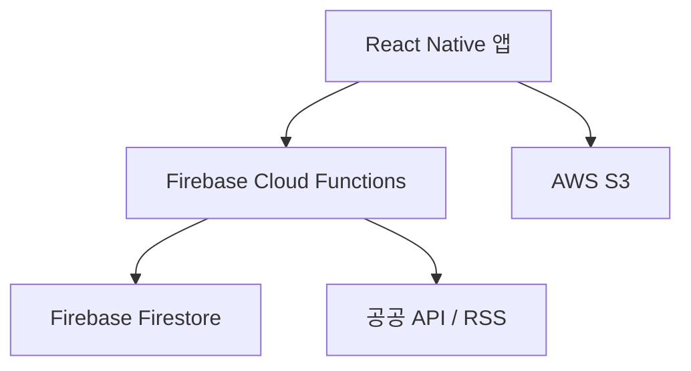

# 기술 요구 사항 문서 (TRD)

## 1. 기술 요약
- **프로젝트 개요**: 수도권 통근/통학 사용자를 위한 실시간 전철 알림 및 대체 경로 제안 모바일 앱 개발. React Native 기반의 크로스 플랫폼 앱으로 Firebase를 백엔드로 활용하여 실시간 데이터 처리 및 사용자 인증/관리를 효율적으로 구현.
- **핵심 기술 스택**: React Native, TypeScript, Firebase Firestore, Firebase Auth, Firebase Cloud Functions, Firebase ML, TailwindCSS 또는 Styled-components, Expo, GitHub Actions, AWS S3 (자산 백업).
- **주요 기술 목표**: 높은 알림 정확도(≥ 95%), 낮은 앱 삭제율(< 5%), 실시간 데이터 처리, 확장 가능한 아키텍처 구축.
- **주요 기술 가정**: 공공 API 및 파트너십을 통해 실시간 열차 데이터 확보 가능, Firebase 서비스 안정적 운영.

## 2. 기술 스택

| Category          | Technology / Library        | Reasoning (Why it's chosen for this project) |
| ----------------- | --------------------------- | -------------------------------------------- |
| 플랫폼             | React Native                | 크로스 플랫폼 개발, iOS/Android 동시 지원, 빠른 개발 속도 |
| 언어               | TypeScript                  | 정적 타입 지원, 코드 안정성 및 유지보수성 향상 |
| 데이터베이스        | Firebase Firestore            | 실시간 데이터 동기화, NoSQL, 확장성, 서버리스 |
| 인증               | Firebase Auth               | 간편한 사용자 인증 및 관리, 다양한 인증 방식 지원 |
| 백엔드 로직        | Firebase Cloud Functions      | 서버리스 함수, 이벤트 기반 로직 처리, 확장성 |
| 머신러닝           | Firebase ML                 | 사용자 패턴 분석, 예측 알림 기능 구현 |
| UI 프레임워크      | TailwindCSS or Styled-components | 컴포넌트 스타일링, 빠른 UI 개발, 유지보수성 |
| 개발 도구          | Expo                      | 간편한 개발 환경 설정, 빌드 및 배포 |
| CI/CD             | GitHub Actions              | 자동화된 빌드, 테스트, 배포 파이프라인 구축 |
| 자산 백업         | AWS S3                    | 이미지, 비디오 등 정적 자산 백업 및 관리 |

## 3. 시스템 아키텍처 설계

### Top-Level building blocks
- **모바일 앱 (React Native)**:
    - UI 컴포넌트: 사용자 인터페이스 (알림 표시, 지도, 설정 등)
    - 상태 관리: Redux 또는 Context API
    - API 클라이언트: Firebase Cloud Functions 호출
- **백엔드 (Firebase Cloud Functions)**:
    - 데이터 수집기: 공공 API, RSS 크롤러 연동
    - 데이터 처리기: 데이터 정제, 변환, 저장
    - 알림 엔진: 실시간 알림 생성 및 전송
    - 추천 엔진: 대체 경로 및 혼잡도 추천
- **데이터베이스 (Firebase Firestore)**:
    - 열차 정보: 실시간 열차 위치, 지연 정보
    - 노선 정보: 역, 노선 메타 정보
    - 사용자 정보: 즐겨찾기, 알림 설정
    - 혼잡도 정보: 센서 데이터, 사용자 제보
- **자산 저장소 (AWS S3)**:
    - 이미지: 앱 내 사용 이미지, 워치 컴플리케이션 이미지
    - 비디오: 튜토리얼, 광고 비디오

### Top-Level Component Interaction Diagram



- React Native 앱은 Firebase Cloud Functions를 통해 데이터 요청 및 업데이트를 수행합니다.
- Firebase Cloud Functions는 공공 API/RSS에서 데이터를 수집하고 Firebase Firestore에 저장합니다.
- Firebase Cloud Functions는 데이터 변경 시 React Native 앱에 실시간 알림을 전송합니다.
- React Native 앱은 AWS S3에 저장된 이미지/비디오 자산을 사용합니다.

### Code Organization & Convention
**Domain-Driven Organization Strategy**
- **Domain Separation**: 사용자 관리, 열차 정보, 알림, 경로 추천 등 도메인별로 코드 분리
- **Layer-Based Architecture**: UI 컴포넌트, 비즈니스 로직, 데이터 액세스 레이어로 분리
- **Feature-Based Modules**: 각 기능(실시간 알림, 대체 경로 제안 등)별로 모듈화
- **Shared Components**: 공통 UI 컴포넌트, 유틸리티 함수, 타입 정의를 공유 모듈로 관리

**Universal File & Folder Structure**
```
/
├── src/
│   ├── components/          # UI 컴포넌트
│   │   ├── common/           # 공통 컴포넌트
│   │   ├── train/            # 열차 관련 컴포넌트
│   │   ├── map/              # 지도 관련 컴포넌트
│   │   └── ...
│   ├── screens/             # 화면
│   │   ├── home/             # 홈 화면
│   │   ├── settings/         # 설정 화면
│   │   └── ...
│   ├── services/            # API 호출, 데이터 처리
│   │   ├── api/              # API 클라이언트
│   │   ├── train/            # 열차 정보 서비스
│   │   ├── notification/     # 알림 서비스
│   │   └── ...
│   ├── models/              # 데이터 모델
│   │   ├── train.ts          # 열차 정보 모델
│   │   ├── user.ts           # 사용자 정보 모델
│   │   └── ...
│   ├── utils/               # 유틸리티 함수
│   │   ├── date.ts           # 날짜 관련 유틸리티
│   │   ├── location.ts       # 위치 관련 유틸리티
│   │   └── ...
│   ├── hooks/               # 커스텀 훅
│   │   ├── useTrainData.ts   # 열차 데이터 훅
│   │   └── ...
│   ├── App.tsx              # 앱 진입점
│   └── index.tsx            # React Native 앱 등록
├── functions/              # Firebase Cloud Functions
│   ├── src/
│   │   ├── index.ts          # 함수 진입점
│   │   ├── train/            # 열차 관련 함수
│   │   ├── notification/     # 알림 관련 함수
│   │   └── ...
│   └── package.json
├── .gitignore
├── README.md
├── package.json
├── tsconfig.json
└── ...
```

### Data Flow & Communication Patterns
- **Client-Server Communication**: React Native 앱은 Firebase Cloud Functions HTTP 엔드포인트 호출하여 데이터 요청 및 업데이트. 응답은 JSON 형식으로 반환.
- **Database Interaction**: Firebase Cloud Functions는 Firebase Firestore SDK를 사용하여 데이터 읽기/쓰기 수행.
- **External Service Integration**: Firebase Cloud Functions는 `axios` 또는 `node-fetch`를 사용하여 공공 API 및 RSS 피드에서 데이터 수집.
- **Real-time Communication**: Firebase Firestore의 실시간 리스너를 사용하여 데이터 변경 시 React Native 앱에 실시간 업데이트 전송.
- **Data Synchronization**: Firebase Firestore의 트랜잭션 기능을 사용하여 데이터 일관성 유지.

## 4. 성능 & 최적화 전략

- **데이터 캐싱**: 자주 사용되는 데이터는 로컬 스토리지 또는 메모리에 캐싱하여 API 호출 횟수 최소화.
- **이미지 최적화**: 이미지 크기 최적화, WebP 포맷 사용, CDN 활용.
- **코드 분할**: React Native 번들 크기 줄이기 위해 코드 분할 적용.
- **비동기 처리**: 시간이 오래 걸리는 작업은 비동기적으로 처리하여 UI 응답성 유지.

## 5. 구현 로드맵 & 마일스톤
### Phase 1: Foundation (MVP 구현)
- **핵심 인프라**: React Native 프로젝트 설정, Firebase 프로젝트 설정, CI/CD 파이프라인 구축.
- **필수 기능**: 실시간 열차 도착/지연 알림, 즐겨찾기 역/노선 관리.
- **기본 보안**: Firebase Auth를 사용한 사용자 인증, 데이터베이스 보안 규칙 설정.
- **개발 환경**: 개발 환경 설정, 코드 컨벤션 정의, 코드 리뷰 프로세스 구축.
- **일정**: 8주

### Phase 2: 기능 개선
- **고급 기능**: 장애 발생/운행 중단 긴급 알림, 대체 노선/경로 제안, 실시간 혼잡도 정보.
- **성능 최적화**: 데이터 캐싱, 이미지 최적화, 코드 분할.
- **보안 강화**: 추가 보안 기능 구현 (예: 2단계 인증), 개인정보 보호 강화.
- **모니터링 구현**: Firebase Performance Monitoring, Crashlytics 설정.
- **일정**: 12주

## 6. 리스크 평가 & 완화 전략
### Technical Risk Analysis
- **기술 리스크**: 실시간 데이터 정확도 부족, 공공 API 제한/변경, Firebase 서비스 장애.
- **성능 리스크**: 실시간 데이터 처리량 증가, 알림 전송 지연, 앱 응답성 저하.
- **보안 리스크**: 사용자 정보 유출, 데이터 위변조, 악성 코드 삽입.
- **통합 리스크**: 공공 API 연동 실패, Firebase 서비스 연동 문제.
- **완화 전략**:
    - 복수 데이터 소스 교차 검증, 사용자 제보 반영.
    - 캐싱/폴백 전략, 파트너십 체결.
    - 데이터 암호화, 보안 코딩, 정기적인 보안 점검.
    - API 연동 테스트, 에러 핸들링, 재시도 로직 구현.

### Project Delivery Risks
- **일정 리스크**: 개발 일정 지연, 기능 범위 변경.
- **자원 리스크**: 개발 인력 부족, 기술 전문가 부재.
- **품질 리스크**: 코드 품질 저하, 테스트 부족.
- **배포 리스크**: 배포 환경 문제, 배포 실패.
- **대응 계획**:
    - 기능 우선순위 조정, 스프린트 조정.
    - 추가 인력 확보, 기술 교육 제공.
    - 코드 리뷰 강화, 자동화된 테스트 구축.
    - 배포 전 테스트, 롤백 전략 수립.
